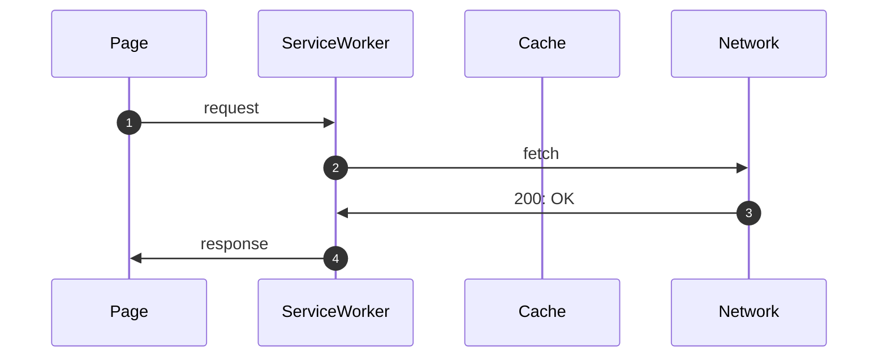
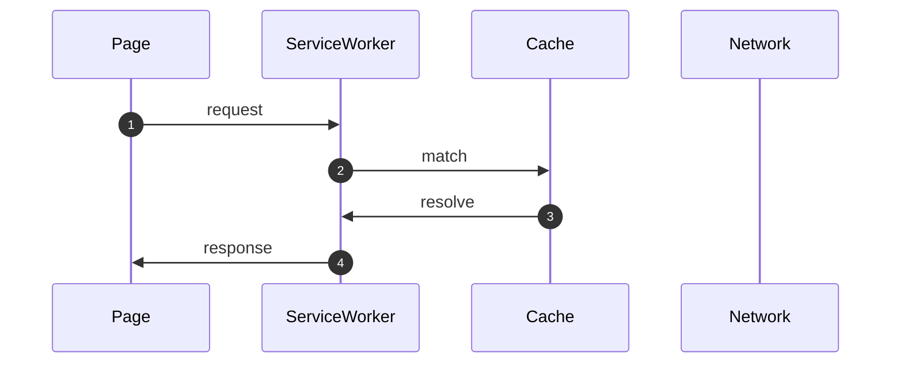
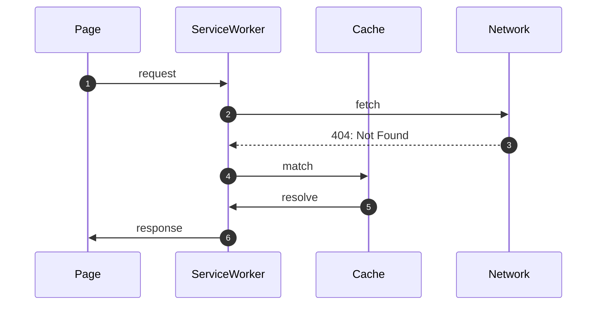
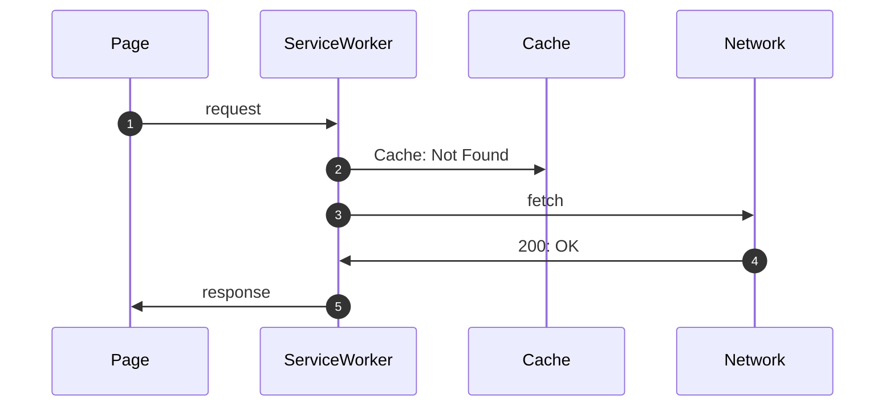
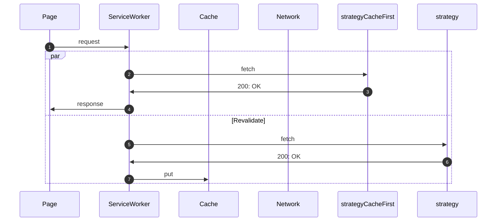
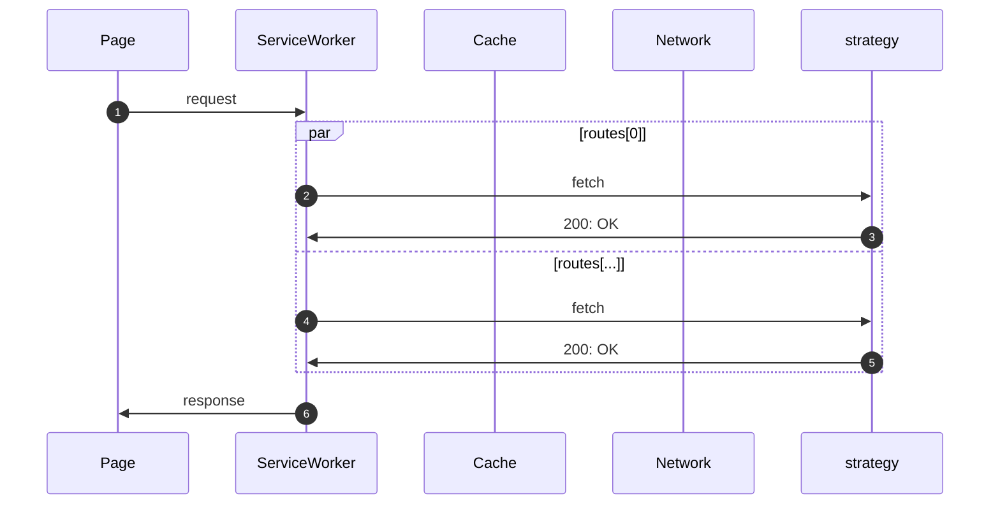
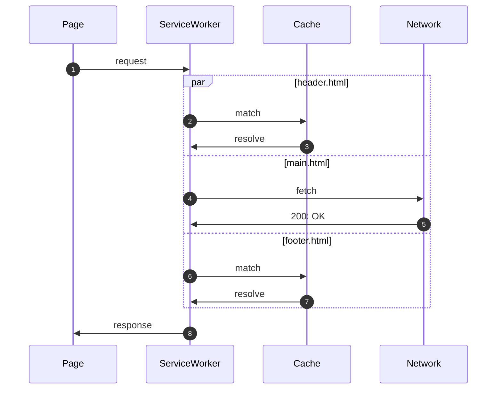
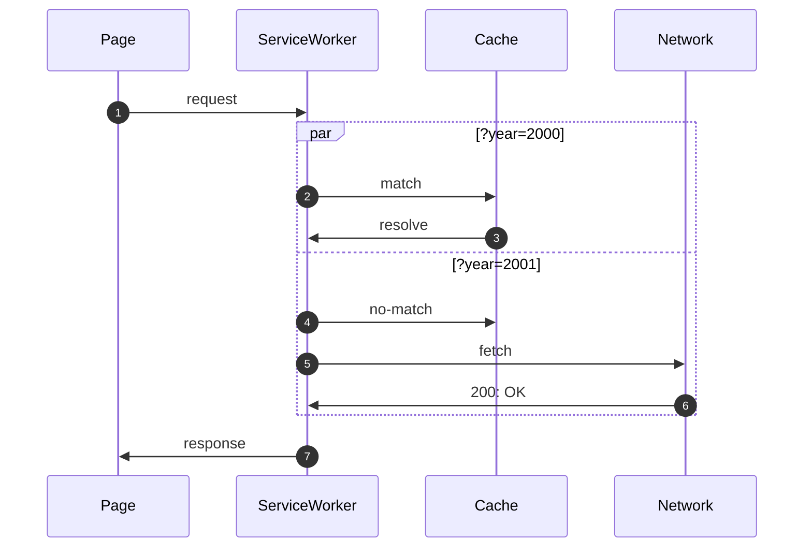

# The WorkBee ServiceWorker 🐝

A tiny ServiceWorker for secure web applications.

## Features

- Free to use under MIT license
- Small and modular (up to 1KB minify + brotli)
- Tree-shaking supported
- Zero (0) dependencies
- GDPR Compliant

## TODO

- improve test coverage
- more e2e tests
- documentation
- session management
- Push events
- Range Requests strategy
- precache extract zip
- workbox comparison (~1KB vs ~70KB)

## Getting Started

### Install

```bash
npm install @workbee/core
```

### Basic Setup

```js
import { compileConfig, installEvent, activateEvent, fetchEvent, strategyCacheFirst } from '@workbee/core'

const config = compileConfig({
  cachePrefix, '1-',
  //precache: ['/path/to/file.ext'],
  routes: [
    {
      methods: ['GET'],
      pathPattern: new RegExp('/img/(.+)$'),
      cacheName: 'img',
      strategy: strategyCacheFirst
    },
    ...
  ]
})

addEventListener('install', (event) => {
  installEvent(event, config)
})

addEventListener('activate', (event) => {
  activateEvent(event, config)
})

addEventListener('fetch', (event) => {
  fetchEvent(event, config)
})

```

## Events

### Install

### Activate

### Fetch

### Push (future)

### BackgroundFetch (future)

```js
import { backgroundFetchSuccessEvent, backgroundFetchFailEvent } from '@workbee/core'

...

self.addEventListener('backgroundfetchsuccess', (event) => {
  backgroundFetchSuccessEvent(event, config)
})

self.addEventListener('backgroundfetchfail', (event) => {
  backgroundFetchFailEvent(event, config)
})
```

## Strategies

### Network Only



### Cache Only



### Network First



### Cache First



### StaleWhileRevalidate



### Partition



### HTML Partitioning

Breaks a page into parts that can each have their own strategy. ie `<head>`, `<header>`, `<main>`, and `<footer>` where only the `<main>` may need to be requested when multiple pages are being viewed (`<main>` in this case should bootstrap the `<head>` using js).



### Request Partitioning

```javascript
import { compileConfig } @workbee/core
import { installEvent, activateEvent, fetchEvent } from '@workbee/events'
import { strategyCacheFirst, strategyPartition } from '@workbee/strategies'

const config = compileConfig({
  cachePrefix, 'sw-VERSION-',
  routes: [
    {
      methods: ['GET'],
      pathPattern: new RegExp('/api/data$'),
      cacheName: 'data',
      strategy: strategyPartition(compileConfig({
        strategy: strategyCacheFirst,
        cacheName: 'strategyPartition',
        makeRequests: () => []
      }),
      cacheMaxAgeInSeconds: -1
    },
    ...
  ]
})

addEventListener('install', (event) => {
  installEvent(event, config)
})

addEventListener('activate', async (event) => {
  await activateEvent(event, config)
})

addEventListener('fetch', (event) => {
  fetchEvent(event, config)
})

```



## Middleware

### SaveData

Choose strategy based on if Save-Data is enabled.

### Session Management (future)

```js

```

### Offline Request Enqueue

## Examples

https://serviceworke.rs
https://github.com/mdn/serviceworker-cookbook

### Caching strategies

#### [Network or cache](https://serviceworke.rs/strategy-network-or-cache.html)

```javascript
/* eslint-env: serviceworker */
import { strategyNetworkFirst } from '@workbee/core'

const config = {
  strategy: strategyNetworkFirst
}

addEventListener('install', (event) => {
  eventInstall(event, config)
})

addEventListener('activate', (event) => {
  eventActivate(event, config)
})

addEventListener('fetch', (event) => {
  eventFetch(event, config)
})
```

#### [Cache only](https://serviceworke.rs/strategy-cache-only.html)

```javascript
/* eslint-env: serviceworker */
import { strategyCacheOnly } from '@workbee/core'

const config = {
  strategy: strategyCacheOnly
}

addEventListener('install', (event) => {
  eventInstall(event, config)
})

addEventListener('activate', (event) => {
  eventActivate(event, config)
})

addEventListener('fetch', (event) => {
  eventFetch(event, config)
})
```

#### [Cache and update](https://serviceworke.rs/strategy-cache-and-update.html)

```javascript
/* eslint-env: serviceworker */
import { strategyStaleWhileRevalidate } from '@workbee/core'

const config = {
  strategy: strategyStaleWhileRevalidate
}

addEventListener('install', (event) => {
  eventInstall(event, config)
})

addEventListener('activate', (event) => {
  eventActivate(event, config)
})

addEventListener('fetch', (event) => {
  eventFetch(event, config)
})
```

#### [Cache, update and refresh](https://serviceworke.rs/strategy-cache-update-and-refresh.html)

TODO refresh middleware, add to strategyStaleWhileRevalidate?

#### [Embedded fallback](https://serviceworke.rs/strategy-embedded-fallback.html)

```javascript
/* eslint-env: serviceworker */
import { strategyNetworkOnly, strategyCacheOnly } from '@workbee/core'
import fallbackMiddleware from '@workbee/fallback'

const fallback = fallbackMiddleware({ path: '/path/to/fallback' })
const config = {
  precache: {
    routes: [
      {
        path: '/path/to/fallback'
      }
    ],
    strategy: strategyCacheOnly
  },
  strategy: strategyNetworkOnly,
  after: [fallback.after]
}

addEventListener('install', (event) => {
  eventInstall(event, config)
})

addEventListener('activate', (event) => {
  eventActivate(event, config)
})

addEventListener('fetch', (event) => {
  eventFetch(event, config)
})
```

### Web Push

### General Usage

### Offline

#### [Offline fallback](https://serviceworke.rs/offline-fallback.html)

```javascript
/* eslint-env: serviceworker */
import { strategyNetworkOnly, strategyCacheOnly } from '@workbee/core'
import fallbackMiddleware from '@workbee/fallback'

const fallback = fallbackMiddleware({
  path: '/path/to/offline',
  statusCodes: [503, 504] // or Error
})
const config = {
  precache: {
    routes: [
      {
        path: '/path/to/offline'
      }
    ],
    strategy: strategyCacheOnly
  },
  strategy: strategyNetworkOnly,
  after: [fallback.after]
}

addEventListener('install', (event) => {
  eventInstall(event, config)
})

addEventListener('activate', (event) => {
  eventActivate(event, config)
})

addEventListener('fetch', (event) => {
  eventFetch(event, config)
})
```

#### [Offline Status](https://serviceworke.rs/offline-status.html)

```javascript
/* eslint-env: serviceworker */
import { strategyCacheFirst, strategyCacheOnly } from '@workbee/core'

const config = {
  precache: {
    routes: [
      {
        path: '/path/to/required'
      },
      ...
    ],
    eventType: 'precache'
  },
  strategy: strategyCacheFirst
}

addEventListener('install', (event) => {
  eventInstall(event, config)
})

addEventListener('activate', (event) => {
  eventActivate(event, config)
})

addEventListener('fetch', (event) => {
  eventFetch(event, config)
})
```

#### [JSON Cache](https://serviceworke.rs/json-cache.html)

```javascript
/* eslint-env: serviceworker */
import { strategyCacheFirst, strategyCacheOnly } from '@workbee/core'

const config = {
  precache: {
    routes: '/path/to/precache.json',
    extract: // TODO
  },
  strategy: strategyCacheFirst
}

addEventListener('install', (event) => {
  eventInstall(event, config)
})

addEventListener('activate', (event) => {
  eventActivate(event, config)
})

addEventListener('fetch', (event) => {
  eventFetch(event, config)
})
```

### Beyond Offline

#### [Local Download](https://serviceworke.rs/local-download.html)

```javascript
/* eslint-env: serviceworker */
/*import { strategyLocalDownload } from '@workbee/core'

const config = {
  routes: [
    {
      pathPattern: new Regexp('/path/to/download/.*$'),
      strategy: strategyLocalDownload
    }
  ]
}

addEventListener('install', (event) => {
  eventInstall(event, config)
})

addEventListener('activate', (event) => {
  eventActivate(event, config)
})

addEventListener('fetch', (event) => {
  eventFetch(event, config)
})*/
```

#### [Virtual Server](https://serviceworke.rs/virtual-server.html)

#### [API Analytics](https://serviceworke.rs/api-analytics.html)

TODO 3rd party middleware - ie plausible

#### [Load balancer](https://serviceworke.rs/load-balancer.html)

TODO new middleware.before - group external domains to allow request path replace & ping all to pick best

#### [Cache from ZIP](https://serviceworke.rs/cache-from-zip.html)

TODO new plugin - return empty response, iterate over contents and cachePut

#### [Dependency Injection](https://serviceworke.rs/dependency-injector.html)

TODO need to understand more

#### [Request Deferrer](https://serviceworke.rs/request-deferrer.html)

```javascript
/* eslint-env: serviceworker */
import { strategyCacheFirst } from '@workbee/core'
import { offlineMiddleware } from '@workbee/offline'

const offline = offlineMiddleware({ pollDelay: 0 })
const config = {
  strategy: strategyCacheFirst,
  middlewares: [offline]
}

addEventListener('install', (event) => {
  eventInstall(event, config)
})

addEventListener('activate', (event) => {
  eventActivate(event, config)
})

addEventListener('fetch', (event) => {
  eventFetch(event, config)
})

addEventListener('message', (event) => {
  const { data } = event
  event.waitUntil(messageEvents[data.type](data))
})
const messageEvents = {
  online: offline.onlineEvent
}
```

### Performance

#### [Cache then Network](https://serviceworke.rs/cache-then-network.html)

```javascript
/* eslint-env: serviceworker */
import { strategyCacheFirst } from '@workbee/core'

const config = {
  strategy: strategyCacheFirst
}

addEventListener('install', (event) => {
  eventInstall(event, config)
})

addEventListener('activate', (event) => {
  eventActivate(event, config)
})

addEventListener('fetch', (event) => {
  eventFetch(event, config)
})
```

#### [Render Store](https://serviceworke.rs/render-store.html)

```javascript
/* eslint-env: serviceworker */
import {
  compileConfig,
  eventInstall,
  eventActivate,
  eventFetch,
  cacheOverrideEvent
} from '@workbee/core'

const config = compileConfig({
  strategy: strategyNetworkFirst
})

addEventListener('install', (event) => {
  eventInstall(event, config)
})

addEventListener('activate', (event) => {
  eventActivate(event, config)
})

addEventListener('fetch', (event) => {
  eventFetch(event, config)
})

addEventListener('message', (event) => {
  const { data } = event
  /* data = {
    type: 'cache',
    request: new Request('/path/to/template', {method:'GET'}),
    response: new Response('')
  }*/
  event.waitUntil(messageEvents[data.type](data))
})
const messageEvents = {
  cache: cacheOverrideEvent(config)
}
```
