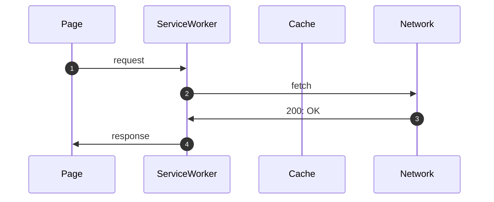
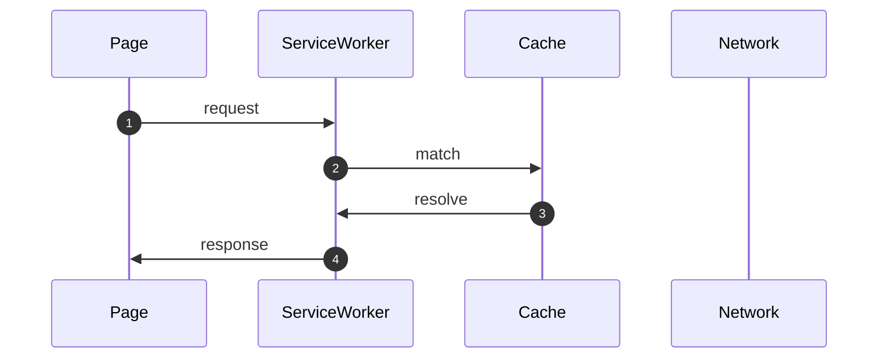
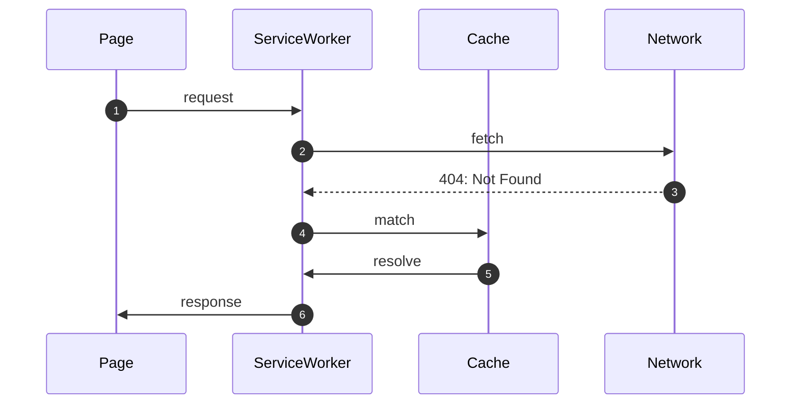
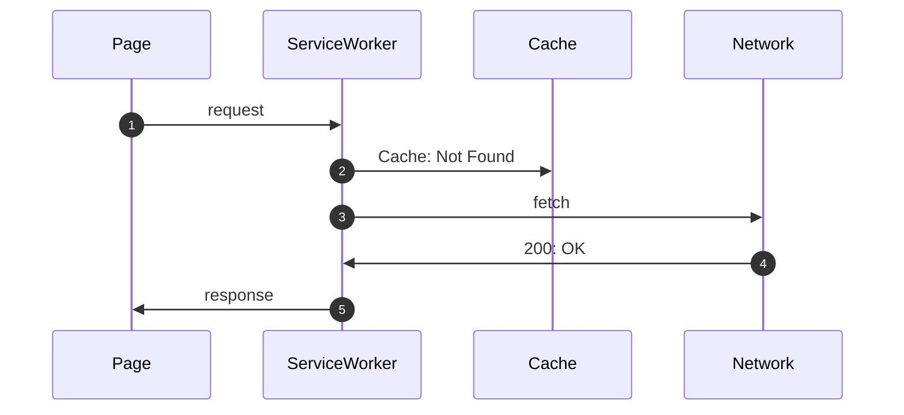
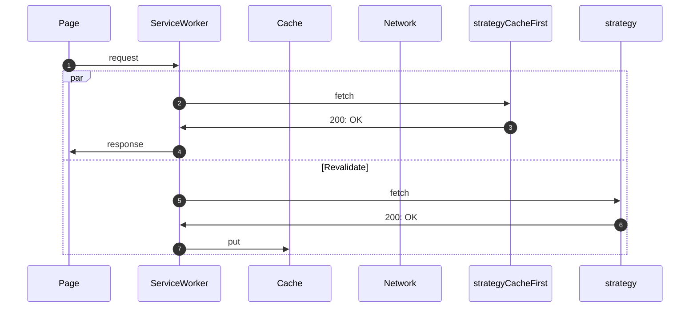
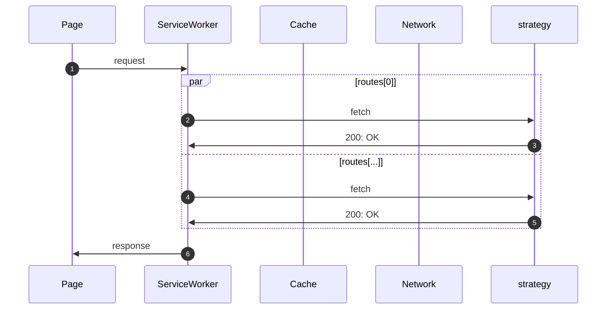
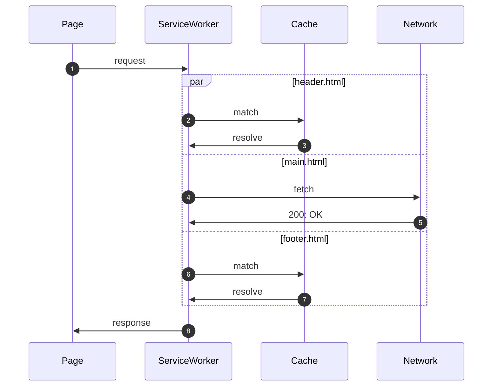
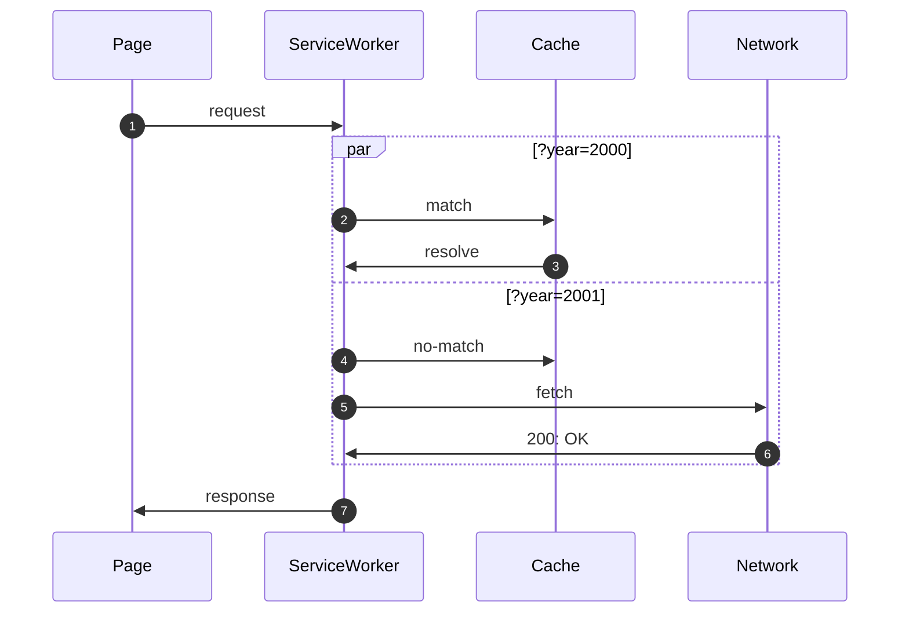

<div align="center">
  
  <p><strong>A tiny ServiceWorker for secure web applications.</strong></p>
<p>
  <a href="https://github.com/willfarrell/workbee/actions/workflows/test-unit.yml"></a>
  <a href="https://github.com/willfarrell/workbee/actions/workflows/test-dast.yml"></a>
  <a href="https://github.com/willfarrell/workbee/actions/workflows/test-perf.yml"></a>
  <a href="https://github.com/willfarrell/workbee/actions/workflows/test-sast.yml"></a>
  <a href="https://github.com/willfarrell/workbee/actions/workflows/test-lint.yml"></a>
  <br/>
  <a href="https://www.npmjs.com/package/@work-bee/core"></a>
  <a href="https://packagephobia.com/result?p=@work-bee/core"></a>
  <a href="https://www.npmjs.com/package/@work-bee/core"></a>
  <a href="https://www.npmjs.com/package/@work-bee/core#provenance">
  </a>
  <br/>
  <a href="https://scorecard.dev/viewer/?uri=github.com/willfarrell/workbee"></a>
  <a href="https://slsa.dev"></a>
  <a href="https://github.com/willfarrell/workbee/blob/main/CONTRIBUTING.md"></a>
  <a href="https://biomejs.dev"></a>
  <a href="https://conventionalcommits.org"></a>
</p>
<p>You can read the documentation at: <a href="https://workbee.js.org">https://workbee.js.org</a></p>
</div>

## Features

- Free to use under MIT license
- Small and modular (up to 1KB minify + brotli)
- Tree-shaking supported
- Zero (0) dependencies
- GDPR Compliant

## Browser Support

WorkBee requires [ServiceWorker](https://developer.mozilla.org/en-US/docs/Web/API/Service_Worker_API) and [Cache API](https://developer.mozilla.org/en-US/docs/Web/API/Cache) support.

| Browser | Minimum Version |
|---------|----------------|
| Chrome  | 57+            |
| Edge    | 17+            |
| Firefox | 58+            |
| Safari  | 15.4+          |
| Opera   | 44+            |

The `@work-bee/offline` package additionally requires [IndexedDB](https://developer.mozilla.org/en-US/docs/Web/API/IndexedDB_API) (supported in all browsers listed above).

## Getting Started

### Install

```bash
npm install @work-bee/core
```

### Basic Setup

```js
import { compileConfig, eventInstall, eventActivate, eventFetch, strategyCacheFirst } from '@work-bee/core'

const config = compileConfig({
  cachePrefix: '1-',
  //precache: ['/path/to/file.ext'],
  routes: [
    {
      methods: ['GET'],
      pathPattern: new RegExp('/img/(.+)$'),
      cacheName: 'img',
      strategy: strategyCacheFirst
    },
    ...
  ]
})

addEventListener('install', (event) => {
  eventInstall(event, config)
})

addEventListener('activate', (event) => {
  eventActivate(event, config)
})

addEventListener('fetch', (event) => {
  eventFetch(event, config)
})

```

## Events

### Install

Handles pre-caching of resources.

### Activate

Cleans up old caches.

### Fetch

Routes requests through configured strategies and middleware.

### Push (future)

### BackgroundFetch (future)

```js
import { backgroundFetchSuccessEvent, backgroundFetchFailEvent } from '@work-bee/core'

...

self.addEventListener('backgroundfetchsuccess', (event) => {
  backgroundFetchSuccessEvent(event)
})

self.addEventListener('backgroundfetchfail', (event) => {
  backgroundFetchFailEvent(event)
})
```

## Strategies

### Network Only


```mermaid
sequenceDiagram
    participant Page
    participant ServiceWorker
    participant Cache
    participant Network
    autonumber
    Page->>ServiceWorker: request
    ServiceWorker->>Network: fetch
	Network->>ServiceWorker: 200: OK
	ServiceWorker->>Page: response
```

### Cache Only


```mermaid
sequenceDiagram
    participant Page
    participant ServiceWorker
    participant Cache
    participant Network
    autonumber
    Page->>ServiceWorker: request
    ServiceWorker->>Cache: match
    Cache->>ServiceWorker: resolve
	ServiceWorker->>Page: response
```

### Network First


```mermaid
sequenceDiagram
    participant Page
    participant ServiceWorker
    participant Cache
    participant Network
    autonumber
    Page->>ServiceWorker: request
    ServiceWorker->>Network: fetch
    Network-->>ServiceWorker: 404: Not Found
    ServiceWorker->>Cache: match
    Cache->>ServiceWorker: resolve
    ServiceWorker->>Page: response
```

### Cache First


```mermaid
sequenceDiagram
    participant Page
    participant ServiceWorker
    participant Cache
    participant Network
    autonumber
    Page->>ServiceWorker: request
    ServiceWorker->>Cache: Cache: Not Found
    ServiceWorker->>Network: fetch
	Network->>ServiceWorker: 200: OK
	ServiceWorker->>Page: response
```

### StaleWhileRevalidate


```mermaid
sequenceDiagram
    participant Page
    participant ServiceWorker
    participant Cache
    participant Network
    autonumber
    Page->>ServiceWorker: request
    par
        ServiceWorker->>strategyCacheFirst: fetch
        strategyCacheFirst->>ServiceWorker: 200: OK
	      ServiceWorker->>Page: response
    and Revalidate
        ServiceWorker->>strategy: fetch
        strategy->>ServiceWorker: 200: OK
        ServiceWorker->>Cache: put
    end
```

### Partition


```mermaid
sequenceDiagram
    participant Page
    participant ServiceWorker
    participant Cache
    participant Network
    autonumber
    Page->>ServiceWorker: request
    par routes[0]
        ServiceWorker->>strategy: fetch
        strategy->>ServiceWorker: 200: OK
    and routes[...]
        ServiceWorker->>strategy: fetch
        strategy->>ServiceWorker: 200: OK
    end
    ServiceWorker->>Page: response
```

### HTML Partitioning

Breaks a page into parts that can each have their own strategy. ie `<head>`, `<header>`, `<main>`, and `<footer>` where only the `<main>` may need to be requested when multiple pages are being viewed (`<main>` in this case should bootstrap the `<head>` using js).


```mermaid
sequenceDiagram
    participant Page
    participant ServiceWorker
    participant Cache
    participant Network
    autonumber
    Page->>ServiceWorker: request
    par header.html
        ServiceWorker->>Cache: match
        Cache->>ServiceWorker: resolve
    and main.html
        ServiceWorker->>Network: fetch
        Network->>ServiceWorker: 200: OK
    and footer.html
        ServiceWorker->>Cache: match
        Cache->>ServiceWorker: resolve
    end
	ServiceWorker->>Page: response
```

### Request Partitioning

```javascript
import { compileConfig, eventInstall, eventActivate, eventFetch, strategyCacheFirst, strategyPartition } from '@work-bee/core'

const config = compileConfig({
  cachePrefix: 'sw-VERSION-',
  routes: [
    {
      methods: ['GET'],
      pathPattern: new RegExp('/api/data$'),
      cacheName: 'data',
      strategy: strategyPartition(compileConfig({
        strategy: strategyCacheFirst,
        cacheName: 'strategyPartition',
        makeRequests: () => []
      })),
      cacheControlMaxAge: -1
    },
    ...
  ]
})

addEventListener('install', (event) => {
  eventInstall(event, config)
})

addEventListener('activate', (event) => {
  eventActivate(event, config)
})

addEventListener('fetch', (event) => {
  eventFetch(event, config)
})

```


```mermaid
sequenceDiagram
    participant Page
    participant ServiceWorker
    participant Cache
    participant Network
    autonumber
    Page->>ServiceWorker: request
    par ?year=2000
        ServiceWorker->>Cache: match
        Cache->>ServiceWorker: resolve
    and ?year=2001
        ServiceWorker->>Cache: no-match
        ServiceWorker->>Network: fetch
        Network->>ServiceWorker: 200: OK
    end
	ServiceWorker->>Page: response
```

## Middleware

### SaveData

Choose strategy based on if Save-Data is enabled.

### Session Management

See [@work-bee/session](https://workbee.js.org/docs/packages/session) for authentication token management, session expiry, and inactivity detection.

### Offline Request Enqueue

## Examples

https://serviceworke.rs
https://github.com/mdn/serviceworker-cookbook

### Caching strategies

#### [Network or cache](https://serviceworke.rs/strategy-network-or-cache.html)

```javascript
/* eslint-env: serviceworker */
import { strategyNetworkFirst } from '@work-bee/core'

const config = {
  strategy: strategyNetworkFirst
}

addEventListener('install', (event) => {
  eventInstall(event, config)
})

addEventListener('activate', (event) => {
  eventActivate(event, config)
})

addEventListener('fetch', (event) => {
  eventFetch(event, config)
})
```

#### [Cache only](https://serviceworke.rs/strategy-cache-only.html)

```javascript
/* eslint-env: serviceworker */
import { strategyCacheOnly } from '@work-bee/core'

const config = {
  strategy: strategyCacheOnly
}

addEventListener('install', (event) => {
  eventInstall(event, config)
})

addEventListener('activate', (event) => {
  eventActivate(event, config)
})

addEventListener('fetch', (event) => {
  eventFetch(event, config)
})
```

#### [Cache and update](https://serviceworke.rs/strategy-cache-and-update.html)

```javascript
/* eslint-env: serviceworker */
import { strategyStaleWhileRevalidate } from '@work-bee/core'

const config = {
  strategy: strategyStaleWhileRevalidate
}

addEventListener('install', (event) => {
  eventInstall(event, config)
})

addEventListener('activate', (event) => {
  eventActivate(event, config)
})

addEventListener('fetch', (event) => {
  eventFetch(event, config)
})
```

#### Stale if error

Tries the network; on a thrown error or a 5xx response, serves any cached copy (even expired). Unlike `strategyNetworkFirst`, does not cache successful responses.

```javascript
/* eslint-env: serviceworker */
import { strategyStaleIfError } from '@work-bee/core'

const config = {
  strategy: strategyStaleIfError
}

addEventListener('install', (event) => {
  eventInstall(event, config)
})

addEventListener('activate', (event) => {
  eventActivate(event, config)
})

addEventListener('fetch', (event) => {
  eventFetch(event, config)
})
```

The same behavior is available as the `staleIfError(request, response, config)` helper, which can be composed inside any strategy or middleware that produces a response.

#### [Cache, update and refresh](https://serviceworke.rs/strategy-cache-update-and-refresh.html)

Not yet implemented.

#### [Embedded fallback](https://serviceworke.rs/strategy-embedded-fallback.html)

```javascript
/* eslint-env: serviceworker */
import { strategyNetworkOnly, strategyCacheOnly } from '@work-bee/core'
import fallbackMiddleware from '@work-bee/fallback'

const fallback = fallbackMiddleware({ path: '/path/to/fallback' })
const config = {
  precache: {
    routes: [
      {
        path: '/path/to/fallback'
      }
    ],
    strategy: strategyCacheOnly
  },
  strategy: strategyNetworkOnly,
  after: [fallback.after]
}

addEventListener('install', (event) => {
  eventInstall(event, config)
})

addEventListener('activate', (event) => {
  eventActivate(event, config)
})

addEventListener('fetch', (event) => {
  eventFetch(event, config)
})
```

### Offline

#### [Offline fallback](https://serviceworke.rs/offline-fallback.html)

```javascript
/* eslint-env: serviceworker */
import { strategyNetworkOnly, strategyCacheOnly } from '@work-bee/core'
import fallbackMiddleware from '@work-bee/fallback'

const fallback = fallbackMiddleware({
  path: '/path/to/offline',
  statusCodes: [503, 504] // or Error
})
const config = {
  precache: {
    routes: [
      {
        path: '/path/to/offline'
      }
    ],
    strategy: strategyCacheOnly
  },
  strategy: strategyNetworkOnly,
  after: [fallback.after]
}

addEventListener('install', (event) => {
  eventInstall(event, config)
})

addEventListener('activate', (event) => {
  eventActivate(event, config)
})

addEventListener('fetch', (event) => {
  eventFetch(event, config)
})
```

#### [Offline Status](https://serviceworke.rs/offline-status.html)

```javascript
/* eslint-env: serviceworker */
import { strategyCacheFirst, strategyCacheOnly } from '@work-bee/core'

const config = {
  precache: {
    routes: [
      {
        path: '/path/to/required'
      },
      ...
    ],
    eventType: 'precache'
  },
  strategy: strategyCacheFirst
}

addEventListener('install', (event) => {
  eventInstall(event, config)
})

addEventListener('activate', (event) => {
  eventActivate(event, config)
})

addEventListener('fetch', (event) => {
  eventFetch(event, config)
})
```

#### [JSON Cache](https://serviceworke.rs/json-cache.html)

```javascript
/* eslint-env: serviceworker */
import { strategyCacheFirst, strategyCacheOnly } from '@work-bee/core'

const config = {
  precache: {
    routes: '/path/to/precache.json',
  },
  strategy: strategyCacheFirst
}

addEventListener('install', (event) => {
  eventInstall(event, config)
})

addEventListener('activate', (event) => {
  eventActivate(event, config)
})

addEventListener('fetch', (event) => {
  eventFetch(event, config)
})
```

### Beyond Offline

#### [Local Download](https://serviceworke.rs/local-download.html)

Not yet implemented.

#### [Virtual Server](https://serviceworke.rs/virtual-server.html)

#### [API Analytics](https://serviceworke.rs/api-analytics.html)

Not yet implemented.

#### [Load balancer](https://serviceworke.rs/load-balancer.html)

Not yet implemented.

#### [Cache from ZIP](https://serviceworke.rs/cache-from-zip.html)

Not yet implemented.

#### [Dependency Injection](https://serviceworke.rs/dependency-injector.html)

Not yet implemented.

#### [Request Deferrer](https://serviceworke.rs/request-deferrer.html)

```javascript
/* eslint-env: serviceworker */
import { strategyCacheFirst } from '@work-bee/core'
import offlineMiddleware from '@work-bee/offline'

const offline = offlineMiddleware({ pollDelay: 0 })
const config = {
  strategy: strategyCacheFirst,
  middlewares: [offline]
}

addEventListener('install', (event) => {
  eventInstall(event, config)
})

addEventListener('activate', (event) => {
  eventActivate(event, config)
})

addEventListener('fetch', (event) => {
  eventFetch(event, config)
})

addEventListener('message', (event) => {
  const { data } = event
  event.waitUntil(messageEvents[data.type](data))
})
const messageEvents = {
  online: offline.postMessageEvent
}
```

### Performance

#### [Cache then Network](https://serviceworke.rs/cache-then-network.html)

```javascript
/* eslint-env: serviceworker */
import { strategyCacheFirst } from '@work-bee/core'

const config = {
  strategy: strategyCacheFirst
}

addEventListener('install', (event) => {
  eventInstall(event, config)
})

addEventListener('activate', (event) => {
  eventActivate(event, config)
})

addEventListener('fetch', (event) => {
  eventFetch(event, config)
})
```

#### [Render Store](https://serviceworke.rs/render-store.html)

```javascript
/* eslint-env: serviceworker */
import {
  compileConfig,
  eventInstall,
  eventActivate,
  eventFetch,
  cacheOverrideEvent
} from '@work-bee/core'

const config = compileConfig({
  strategy: strategyNetworkFirst
})

addEventListener('install', (event) => {
  eventInstall(event, config)
})

addEventListener('activate', (event) => {
  eventActivate(event, config)
})

addEventListener('fetch', (event) => {
  eventFetch(event, config)
})

addEventListener('message', (event) => {
  const { data } = event
  /* data = {
    type: 'cache',
    request: new Request('/path/to/template', {method:'GET'}),
    response: new Response('')
  }*/
  event.waitUntil(messageEvents[data.type](data))
})
const messageEvents = {
  cache: cacheOverrideEvent(config)
}
```

## License

Licensed under [MIT License](LICENSE). Copyright (c) 2026 [will Farrell](https://github.com/willfarrell) and the [Workbee contributors](https://github.com/willfarrell/workbee/graphs/contributors).
